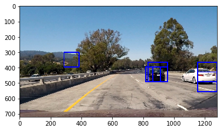
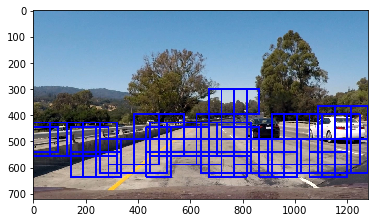
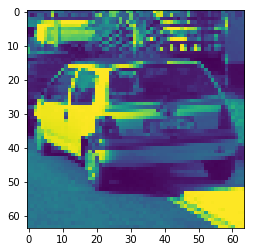
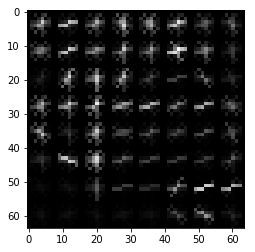
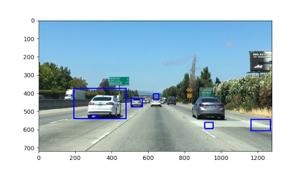
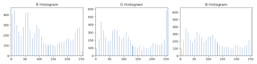
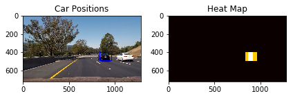

##Vehicle Detection Project

The goals / steps of this project are the following:

* Perform a Histogram of Oriented Gradients (HOG) feature extraction on a labeled training set of images and train a classifier Linear SVM classifier
* Optionally, you can also apply a color transform and append binned color features, as well as histograms of color, to your HOG feature vector. 
* Note: for those first two steps don't forget to normalize your features and randomize a selection for training and testing.
* Implement a sliding-window technique and use your trained classifier to search for vehicles in images.
* Run your pipeline on a video stream (start with the test_video.mp4 and later implement on full project_video.mp4) and create a heat map of recurring detections frame by frame to reject outliers and follow detected vehicles.
* Estimate a bounding box for vehicles detected.

[//]: # (Image References)
[image1]: ./examples/car_not_car.png
[image2]: ./examples/HOG_example.jpg
[image3]: ./examples/sliding_windows.jpg
[image4]: ./examples/sliding_window.jpg
[image5]: ./examples/bboxes_and_heat.png
[image6]: ./examples/labels_map.png
[image7]: ./examples/output_bboxes.png
[video1]: ./project_video.mp4

## [Rubric](https://review.udacity.com/#!/rubrics/513/view) Points
###Here I will consider the rubric points individually and describe how I addressed each point in my implementation.  

---
###Writeup / README

####1. Provide a Writeup / README that includes all the rubric points and how you addressed each one.  You can submit your writeup as markdown or pdf.  [Here](https://github.com/udacity/CarND-Vehicle-Detection/blob/master/writeup_template.md) is a template writeup for this project you can use as a guide and a starting point.  

You're reading it!
My code is contained in Jupyter notebook `003b_model.ipynb` and `lesson_functions.py`.

###Histogram of Oriented Gradients (HOG)

####1. Explain how (and identify where in your code) you extracted HOG features from the training images.

The code for this step is contained in cell 6 of the jupyter notebook `003b_model.ipynb`.  

I started by reading in all the `vehicle` and `non-vehicle` images.  Here is an example of one of each of the `vehicle` and `non-vehicle` classes:

![alt text][image1]

I then explored different color spaces and different `skimage.hog()` parameters (`orientations`, `pixels_per_cell`, and `cells_per_block`).  I grabbed random images from each of the two classes and displayed them to get a feel for what the `skimage.hog()` output looks like.

Here is an example using the `YCrCb` color space and HOG parameters of `orientations=8`, `pixels_per_cell=(8, 8)` and `cells_per_block=(2, 2)`:

![alt text][image2]

####2. Explain how you settled on your final choice of HOG parameters.

To find the best HOG parameters I started with the RGB colourspace and tested the affect of using the 3 different channels on the HOG output. I found that using the YCrCb colour space with all 3 channels provided the best results. 

I also tested the affect of changing the number of orientations, pixels_per_cell and cells_per_block. I found the default settings for these had a good compremise between speed and accuracy since as you increase these values you are increasing the amount of computation required which makes the algorithm take longer to run.

####3. Describe how (and identify where in your code) you trained a classifier using your selected HOG features (and color features if you used them).

I trained a linear SVM in jupyter notebook cell 9. The input data for this was a train and test set created by first shuffling all the input data and then reandomly selected images to add to the train and test sets using sklearn.model_selection.train_test_split().

I chose to use the default parameters and a linear kernel for the SVM and it returned good results on the test set showing good generalisation of the model.

Test accuracy of the SVC = 0.9885
Training took 29.06 seconds on AWS EC2 p2.2large

###Sliding Window Search

####1. Describe how (and identify where in your code) you implemented a sliding window search.  How did you decide what scales to search and how much to overlap windows?

I first started with the slide_window() function in cell 10. I built a for loop that uses two window sizes and overlap parameter of 50% to search the image for cars. The window sizes were (96, 96) and (128, 128). These sizes were chosen by investigatng the affect of increasing and descreasing the window size on the model's ability to identify cars. It was found that a window that was too small e.g.e 64x64 took a lot longer to run, while a window size of 256 was too big and lost the ability to identify cars in the distance.

  

This algorithm worked well however, was slow compared to the Hog subsampling method proposed in section 35 of the course material. In the end the subsampling code (code cell 19) was used to produce the output video. This code uses a similar sliding window method to that above, however, the image is transformed by a scaling factor.

####2. Show some examples of test images to demonstrate how your pipeline is working.  What did you do to optimize the performance of your classifier?

Ultimately I searched on two scales using YCrCb 3-channel HOG features plus spatially binned color and histograms of color in the feature vector, which provided a nice result.  Here are some example images:

This is an example of using the RGB colour space.

  

Creating the HOG transfor of a car image.

  

  

Template Matching is not as effective.

  

Colour histogram forms one of the input features into the SVM model.

  

Investigating how images of cars and not-cars have different clustering patterns in different colour spaces.  

**HSV Colour Space for Car Image**  
Pixels tend to be more spread out, especially in the V channel.  

  

  
**HSV Colour Space for Not Car Image**  
Pixels tend to cluster in bottom right, towards the higher H channel values.

  

---

### Video Implementation

####1. Provide a link to your final video output.  Your pipeline should perform reasonably well on the entire project video (somewhat wobbly or unstable bounding boxes are ok as long as you are identifying the vehicles most of the time with minimal false positives.)
Here's a [link to my video result](./project_video_output12.mp4)

####2. Describe how (and identify where in your code) you implemented some kind of filter for false positives and some method for combining overlapping bounding boxes.

I recorded the positions of positive detections in each frame of the video.  From the positive detections I created a heatmap and then thresholded that map to identify vehicle positions.  I then used `scipy.ndimage.measurements.label()` to identify individual blobs in the heatmap.  I then assumed each blob corresponded to a vehicle.  I constructed bounding boxes to cover the area of each blob detected.  

Here's an example result showing the heatmap from a series of frames of video, the result of `scipy.ndimage.measurements.label()` and the bounding boxes then overlaid on the last frame of video:

### Here are six frames and their corresponding heatmaps:

  

  

  

  

  

  

### Here is the output of `scipy.ndimage.measurements.label()` on the integrated heatmap from all six frames:
![alt text][image6]

### Here the resulting bounding boxes are drawn onto a test image:

  

---

###Discussion

####1. Briefly discuss any problems / issues you faced in your implementation of this project.  Where will your pipeline likely fail?  What could you do to make it more robust?

The approach I took was to use a support vector machines to build a model using spatial binning, colour histograms and HOG feature vectors. Using this combination worked reliably in both bright images and in shadow to identify cars.

The pipeline could be improved by adding tracking of each car as it passess in and out of frame. This would allow a self driving car to identify a vehicle as one it has seen before, rather than labelling it as a new car.

